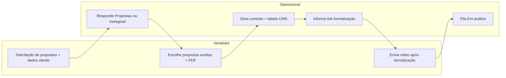

# Atualização v2 — app `contratos` e integração SIAPE

Documento interno descrevendo o que foi implementado, **por quê** e como se encaixa no fluxo operacional (propostas, digitação, formalização, vídeo).

---

## 1. Objetivo

Substituir a esteira antiga baseada em **schemas dinâmicos**, **ConvenioOperacao**, **TabulacaoContrato/SubtabulacaoContrato**, **ContratoOperacional** com `JSON` de dados, etc., por um modelo **normalizado** e um fluxo explícito:

- Dados do cliente pós-contato centralizados em **`ClienteDadosPessoais`** (e tabelas satélite).
- Catálogos próprios do fluxo (**Banco**, **Convenio**, **Produto**, **TabelaCms** no app `contratos`).
- **PropostaDados** (proposta operacional com token numérico 12 dígitos).
- **ContratoExecucao** (contrato com token alfanumérico, fases, link, vídeo, vínculo opcional com **RegisterMoney**).
- Integração com a **carteira SIAPE** (`CarteiraClientes`, `TabulacaoVendedor`) sem substituir o mailing (`siape.Cliente`).

**Motivo:** alinhar banco e código ao processo real (solicitação de propostas → resposta operacional → digitação → formalização → análise → pagamentos), reduzindo configuração genérica e JSON livre.

---

## 2. O que foi removido do banco (migração destrutiva)

As migrações **[0022_remove_estrutura_antiga](migrations/0022_remove_estrutura_antiga.py)** aplicam `DeleteModel` em toda a estrutura legada do app, por exemplo:

- `ContratoOperacional`, `AnexoContrato`
- `Schema`, `SchemaCampo`, `TabelaCalculo`, `FormulaCalculo`, `TabelaComissao`, `RegraTabelaComissao`
- `ConexaoContrato`, `BancoConvenioOperacao`, `OperacaoComposta`, `OperacaoCompostaItem`, `OperacaoPortRefin`, `BancoConvenioOperacaoComposto`
- `ConvenioOperacao`, `BancoConvenio`
- `TabulacaoContrato`, `SubtabulacaoContrato`, `RequisitoEvolucao`
- `Banco`, `Convenio` (modelos antigos com semântica diferente)

**Por quê:** em vez de migrar campo a campo, o schema antigo foi **zerado** e recriado conforme o novo desenho, conforme decisão de projeto (backup obrigatório antes de HML/PROD).

---

## 3. Nova estrutura de dados (`models.py`)

- **`ClienteDadosPessoais`**: raiz; CPF único; FK opcional `cliente_siape` para amarrar ao mailing.
- **`ClienteContato`**, **`ClienteEndereco`**, **`ClienteBancario`**, **`ClienteRepresentante`**: 1:1 com dados pessoais (exceto arquivos).
- **`ClienteArquivo`**: N arquivos por cliente.
- **`Banco`**, **`Convenio`**, **`Produto`**: catálogos do fluxo de contratos (**nota:** existe também `siape.Produto` para carteira/financeiro; podem coexistir até unificação futura).
- **`TabelaCms`**: vínculo banco + convênio + produto + taxas.
- **`SolicitacaoPropostaCliente`**: chamado inicial (carteira + dados do cliente + estado).
- **`PropostaDados`**: linhas de proposta criadas pelo operacional; `codigo` 12 dígitos.
- **`SolicitacaoDigitacao`**: uma por proposta quando o vendedor solicita contrato (PDF obrigatório).
- **`ContratoExecucao`**: contrato gerado; `codigo` alfanumérico; `fase` (ver `fluxo_constants.py`); `link_formalizacao`, `video_cliente`, `destaque_vendedor` (para UI “piscar”/atenção).
- **`ContratoDadosOperacionais`**: snapshot 1:1 com **tabela_cms** e valores no momento da digitação.

**Constantes:** [`fluxo_constants.py`](fluxo_constants.py) — estados da solicitação, da digitação e fases do contrato.

---

## 4. Migrações que criam o novo schema

**[0023_add_nova_estrutura](migrations/0023_add_nova_estrutura.py)** — cria todas as tabelas novas, com dependência de **`siape.0016`** (carteira e tabulações estendidas).

---

## 5. Alterações no `siape` (carteira)

**Migração `siape` 0016** (e modelo em [`apps/siape/models.py`](../siape/models.py)):

- Novos valores em `status_comercial` / `TabulacaoVendedor.tipo`: `SOLICITACAO_PROPOSTAS`, `PROPOSTAS`, `INELEGIVEL`, `DIGITACAO`.
- Campo **`tag_proposta_container`** em `CarteiraClientes` (`AGUARDANDO`, `SUCESSO`, `INELEGIVEL`) para tags no container “Propostas” na consulta.

**Por quê:** o fluxo comercial vive na carteira; o contrato vive no app `contratos`; a combinação status + tag permite filtrar e exibir cards sem duplicar cadastro de cliente.

---

## 6. APIs REST v2 (`apis/fluxo.py` + `urls.py`)

Prefixo base: `/contratos/api/v2/`.

| Endpoint | Função resumida |
|----------|-----------------|
| `solicitacao-proposta/` (POST) | Vendedor envia dados do cliente + arquivos; cria solicitação e atualiza tabulação da carteira. |
| `solicitacoes-pendentes/` (GET) | Operacional lista solicitações a responder. |
| `solicitacao-proposta/responder/` (POST) | Operacional: **Propostas** (lista JSON de propostas) ou **inelegível**. |
| `propostas-por-carteira/` (GET) | Lista `PropostaDados` para o modal na consulta. |
| `propostas-container/` (GET) | Agrega cards + destaques de contrato para o CPF. |
| `solicitar-digitacao/` (POST) | Marca propostas aceitas + PDF obrigatório; uma solicitação por proposta. |
| `fila-operacional/` (GET) | `fila=digitacao` ou `em_analise`. |
| `contrato/gerar-digitacao/` (POST) | Gera `ContratoExecucao` + `ContratoDadosOperacionais` com `tabela_cms_id`. |
| `contrato/<id>/definir-link-formalizacao/` (POST) | Link de formalização; fase **aguardando formalização**; destaque ao vendedor. |
| `contrato/<id>/upload-video/` (POST) | Vendedor envia vídeo; fase **Em análise**. |
| `catalogos/` (GET) | Bancos, convênios e produtos ativos para telas operacionais. |
| `config/resumo/` (GET) e `config/banco|convenio|produto|tabela-cms/` (POST/PATCH/DELETE) | CRUD dos catálogos (`apis/config_catalogos.py`); permissão **`SCT192`**. |

**Permissões:** uso de `@controle_acess` (ex.: `SCT189` operacional, `SCT192` configuração de catálogos).

---

## 7. Telas

### 7.1 Operacional

- **[`templates/contratos/v2/crm_operacional.html`](templates/contratos/v2/crm_operacional.html)** — abas (solicitações, digitação, em análise), ações em JS para responder, gerar contrato e informar link.

### 7.1.1 Configuração de catálogos

- **[`templates/contratos/v2/config.html`](templates/contratos/v2/config.html)** — rota `/contratos/config/` (`config_v2`): CRUD de **Banco**, **Convênio**, **Produto** e **TabelaCms** via APIs `config/*`; **SCT192**.

### 7.2 Vendedor / consulta

- **[`apps/siape/templates/siape/forms/consulta_cliente.html`](../siape/templates/siape/forms/consulta_cliente.html)** — card “Propostas (fluxo contratos)” e link para a configuração de catálogos (quem tem **SCT192**).
- **[`apps/siape/static/siape/js/forms/consulta_cliente_propostas.js`](../siape/static/siape/js/forms/consulta_cliente_propostas.js)** — carrega container, modal de propostas e solicitação de digitação.
- Evento **`moneyconsig:fichaClienteCarregada`** em `consulta_cliente.js` para disparar o carregamento após a ficha do cliente.

### 7.3 Supervisão

- Link para o CRM operacional v2 em **`crm_supervisao.html`**.

### 7.4 Legado

- Templates, rotas e APIs da esteira v1 (CRM kanban, novo contrato, configs, tabela, impressão) foram **removidos**; o fluxo único é o v2.

**Índice `/contratos/`** redireciona para **`crm_operacional_v2`**.

---

## 8. RegisterMoney e financeiro

`ContratoExecucao` possui **`OneToOneField` opcional** para `siape.RegisterMoney` (nome do relacionamento `contrato_execucao` no contrato). A criação automática de registro financeiro nos estados finais de pagamento pode ser ampliada depois; o modelo já permite o vínculo.

---

## 9. Limpeza de legado

Os módulos antigos em **`apps/contratos_v2/apis/`** (`contratos.py`, `schemas.py`, `gerenciar.py`, `tabelas.py`, `tabulacoes_config.py`, `crud_config_esteira.py`) foram **removidos**; permanecem **`fluxo.py`** (fluxo operacional) e **`config_catalogos.py`** (CRUD de catálogos para a tela de configuração).

Comandos de management antigos continuam como **no-op** com mensagem (`popular_tabulacoes_contrato`, `zerar_flags_corretor`).

---

## 10. Deploy e migrações

1. Aplicar migrações do **`siape`** até **0016**.
2. Aplicar **`contratos` 0022** e **0023** (ordem obrigatória).
3. **Backup** do banco antes de produção/homologação: a 0022 **apaga dados** das tabelas antigas do app `contratos`.

---

## 11. Fluxo resumido (referência)

---

*Última atualização deste documento: alinhada à implementação do fluxo v2 descrita acima.*
