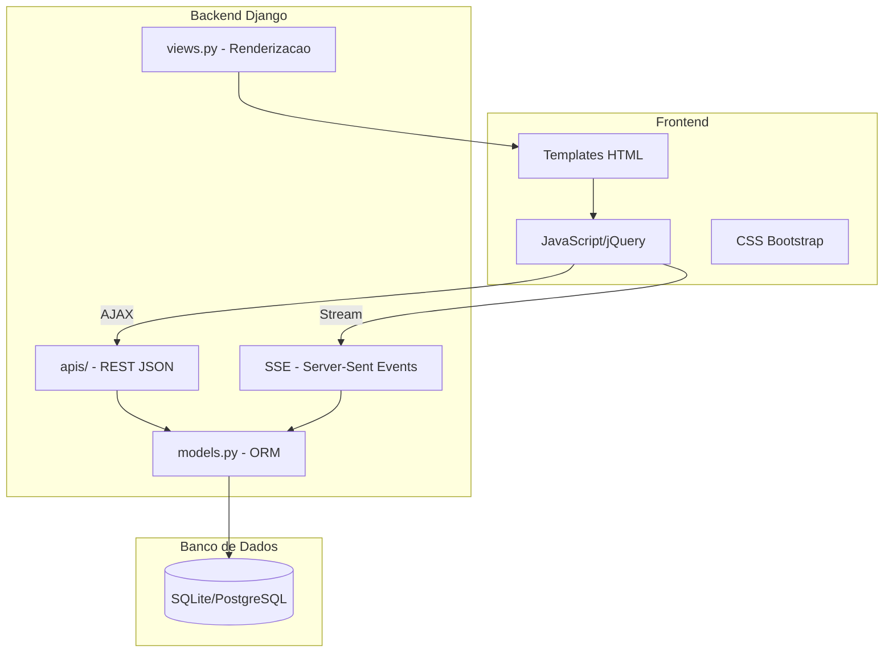

# Documentacao Tecnica Completa - Modulo de Contratos Operacionais

## 1. Arquitetura Geral



---

## 2. Fluxo de Tabulacoes do Sistema

O sistema possui 15 tabulacoes que representam o ciclo de vida de um contrato:

| Ordem | Tabulacao | Cor | Acao Especial |
|-------|-----------|-----|---------------|
| 1 | CONTRATOS ENVIADOS | #17a2b8 | Marcar Incompleto, Informar Link |
| 2 | INCOMPLETO | #ffc107 | Exibe observacoes do que falta |
| 3 | LINK DE FORMALIZACAO | #6f42c1 | Modal com link + Confirmar Assinatura |
| 4 | LINK ASSINADO | #20c997 | - |
| 5 | FORMALIZADO | #28a745 | Solicitar Video |
| 6 | SOLICITACAO DE VIDEO | #fd7e14 | Modal upload video (.mp4, max 25MB) |
| 7 | VIDEO ANEXADO | #6610f2 | Botao ver video |
| 8 | EM ANALISE | #007bff | - |
| 9 | ANUENCIA/AVERBACAO | #e83e8c | - |
| 10 | LIBERACAO | #20c997 | - |
| 11 | ENVIO PARA PAGAMENTO | #17a2b8 | - |
| 12 | CLIENTE PAGO | #28a745 | - |
| 13 | CANCELADO | #dc3545 | Status final negativo |
| 14 | EMPRESA PAGA | #6c757d | - |
| 15 | CLIENTE FINALIZADO | #343a40 | Status final positivo |

---

## 3. Padrao de Templates HTML

Todos os templates seguem esta estrutura em [templates/contratos/](apps/operacional/contratos/templates/contratos/):

```html



Titulo - Sistema
Titulo da Pagina


<link rel="stylesheet" href="">



<div class="container-fluid"
     data-url-api1=""
     data-url-api2=""
     id="pagina-container">
    
    <div class="section-header">
        <h2>Titulo</h2>
    </div>
    <div class="section-body">
        <!-- Conteudo -->
    </div>
</div>

<!-- Modais -->
<div class="modal fade" id="modalExemplo" tabindex="-1" style="z-index: 100002;">
    <!-- Conteudo do modal -->
</div>



<script src=""></script>

```

### Componentes HTML Padrao:

- Cards com `.card`, `.card-header`, `.card-body`
- Formularios com Bootstrap 5 (`.form-control`, `.form-select`, `.form-label`)
- Modais com `z-index: 100002` para ficar acima de tudo
- Tabelas responsivas com `.table`, `.table-striped`
- URLs passadas via `data-attributes` no container principal

---

## 4. Acompanhamento CRM (Kanban)

### 4.1. Estrutura do Kanban

O Kanban possui scroll horizontal para as colunas e scroll vertical em cada coluna:

```css
/* Container do Kanban - Scroll Horizontal */
.kanban-board {
    display: flex;
    flex-direction: row;
    flex-wrap: nowrap;
    gap: 15px;
    overflow-x: auto;
    overflow-y: hidden;
}

/* Colunas com largura fixa */
.kanban-coluna {
    flex: 0 0 280px;
    width: 280px;
    min-width: 280px;
    max-width: 280px;
    max-height: calc(100vh - 280px);
}

/* Body com scroll vertical */
.kanban-body {
    flex: 1;
    overflow-y: auto;
    overflow-x: hidden;
}
```

### 4.2. Acoes por Tabulacao no CRM

O JS verifica a tabulacao e exibe botoes especificos:

```javascript
function criarCardHTML(contrato, tab) {
    const tabulacaoNome = tab.nome.toUpperCase();
    let botoesEspeciais = '';
    
    // LINK DE FORMALIZACAO - Modal com link + confirmar
    if (tabulacaoNome.includes('LINK DE FORMALIZACAO')) {
        if (contrato.link_formalizacao) {
            botoesEspeciais = `<button onclick="abrirModalLinkFormalizacao(...)">
                Ver Link / Confirmar Assinatura
            </button>`;
        }
    }
    
    // SOLICITACAO DE VIDEO - Modal upload
    if (tabulacaoNome.includes('SOLICITACAO DE VIDEO')) {
        botoesEspeciais = `<button onclick="abrirModalUploadVideo(...)">
            Enviar Video do Cliente
        </button>`;
    }
    
    // VIDEO ANEXADO - Ver video
    if (tabulacaoNome.includes('VIDEO ANEXADO') && contrato.video_cliente) {
        botoesEspeciais = `<button onclick="abrirModalVerVideo(...)">
            Ver Video
        </button>`;
    }
}
```

---

## 5. Acompanhamento Tabela (Operacional)

### 5.1. Funcionalidades

- Filtros: Banco, Convenio, Tabulacao, Vendedor, CPF
- Selecao multipla com checkbox
- Acoes em massa (mover varios contratos)
- Paginacao cliente-side
- Acoes especificas por tabulacao

### 5.2. Acoes Disponiveis

| Tabulacao | Acoes Operacional |
|-----------|-------------------|
| CONTRATOS ENVIADOS | Marcar Incompleto, Informar Link |
| FORMALIZADO | Solicitar Video |
| VIDEO ANEXADO | Ver Video |
| Qualquer | Mover para outra tabulacao |

---

## 6. SSE (Server-Sent Events)

### 6.1. Backend - API SSE

```python
from django.http import StreamingHttpResponse
from django.core.cache import cache

SSE_CACHE_KEY = 'contratos_sse_last_update'

def _notificar_atualizacao():
    """Notifica que houve atualizacao"""
    cache.set(SSE_CACHE_KEY, timezone.now().timestamp(), timeout=60)

@login_required
def api_sse_contratos(request):
    def event_stream():
        ultima_verificacao = time.time()
        
        yield f"data: {json.dumps({'etapa': 'conectado'})}\n\n"
        
        while True:
            ultima_atualizacao = cache.get(SSE_CACHE_KEY, 0)
            
            if ultima_atualizacao > ultima_verificacao:
                ultima_verificacao = time.time()
                # Buscar contratos atualizados
                contratos = ContratoOperacional.objects.filter(
                    data_atualizacao__gte=limite
                )
                for contrato in contratos:
                    yield f"data: {json.dumps({'etapa': 'atualizado', 'contrato': {...}})}\n\n"
            
            # Heartbeat
            yield f"data: {json.dumps({'etapa': 'heartbeat'})}\n\n"
            time.sleep(2)
    
    return StreamingHttpResponse(
        event_stream(),
        content_type='text/event-stream'
    )
```

### 6.2. Frontend - Consumo SSE

```javascript
function iniciarSSE() {
    fetch(URLS.sse)
    .then(response => {
        const reader = response.body.getReader();
        const decoder = new TextDecoder();
        let buffer = '';
        
        function processarChunk() {
            reader.read().then(({ done, value }) => {
                if (done) {
                    // Reconectar apos 5s
                    setTimeout(iniciarSSE, 5000);
                    return;
                }
                
                buffer += decoder.decode(value, { stream: true });
                const linhas = buffer.split('\n');
                buffer = linhas.pop();
                
                linhas.forEach(linha => {
                    if (linha.startsWith('data: ')) {
                        const dados = JSON.parse(linha.substring(6));
                        processarEventoSSE(dados);
                    }
                });
                
                processarChunk();
            });
        }
        processarChunk();
    });
}

function processarEventoSSE(dados) {
    switch (dados.etapa) {
        case 'conectado':
            atualizarStatusSSE('conectado');
            break;
        case 'heartbeat':
            break;
        case 'atualizado':
            atualizarCardKanban(dados.contrato);
            break;
    }
}
```

---

## 7. Padrao de JavaScript

Todos os arquivos JS seguem este padrao em [static/contratos/js/](apps/operacional/contratos/static/contratos/js/):

### 7.1. Estrutura Base

```javascript
// URLs dinamicas carregadas dos data-attributes
let URLS = {
    api1: '',
    api2: '',
    sse: ''
};

// Estado da aplicacao
let dadosCache = [];
let sseConectado = false;

$(document).ready(function() {
    // Carregar URLs dos data-attributes
    const container = $('#pagina-container');
    URLS.api1 = container.data('url-api1');
    URLS.api2 = container.data('url-api2');
    URLS.sse = container.data('url-sse');
    
    // Inicializar
    carregarDadosIniciais();
    iniciarSSE();
});

// Funcao de carregamento (AJAX GET)
function carregarAlgo() {
    $.ajax({
        url: URLS.api1,
        method: 'GET',
        data: { parametro: valor },
        success: function(response) {
            if (response.success) {
                renderizarAlgo(response.data);
            }
        }
    });
}

// Funcao de envio (AJAX POST)
function salvarAlgo() {
    $.ajax({
        url: URLS.api2,
        method: 'POST',
        data: { campo: valor },
        headers: { 'X-CSRFToken': getCsrfToken() },
        success: function(response) {
            if (response.success) {
                alert(response.message);
            }
        }
    });
}

// Utilitario para CSRF
function getCsrfToken() {
    return $('[name=csrfmiddlewaretoken]').val() || 
           document.cookie.split('; ')
               .find(row => row.startsWith('csrftoken='))?.split('=')[1];
}
```

### 7.2. Funcoes por Arquivo

| Arquivo | Funcoes Principais |
|---------|-------------------|
| `novo_contrato.js` | `carregarBancos()`, `carregarConvenios()`, `carregarOperacoes()`, `carregarCampos()`, `renderizarPaginas()`, `renderizarCampo()`, `avancarPagina()` |
| `acompanhamento_crm.js` | `iniciarSSE()`, `carregarKanban()`, `renderizarKanban()`, `criarCardHTML()`, `configurarDragAndDrop()`, `abrirModalLinkFormalizacao()`, `confirmarAssinatura()`, `abrirModalUploadVideo()`, `enviarVideo()` |
| `acompanhamento_tabela.js` | `iniciarSSE()`, `carregarContratos()`, `renderizarTabela()`, `criarLinhaHTML()`, `abrirModalIncompleto()`, `confirmarIncompleto()`, `abrirModalInformarLink()`, `moverEmMassa()` |
| `administrativo.js` | `carregarBancos()`, `carregarConvenios()`, `carregarOperacoes()`, `importarSchemaCSV()`, `carregarCamposSchema()` |
| `gerenciar.js` | `carregarBancosTodos()`, `carregarConveniosPorBanco()`, `ativarSchema()`, `desativarSchema()` |

---

## 8. Padrao de APIs REST

Todas as APIs seguem este padrao em [apis/](apps/operacional/contratos/apis/):

### 8.1. Nomenclatura de Funcoes

| Prefixo | Metodo HTTP | Descricao |
|---------|-------------|-----------|
| `api_get_` | GET | Buscar/listar dados |
| `api_post_` | POST | Criar/atualizar/deletar dados |
| `api_sse_` | GET | Stream Server-Sent Events |

### 8.2. Estrutura de Resposta JSON

```python
# Sucesso
return JsonResponse({
    'success': True,
    'message': 'Operacao realizada com sucesso!',
    'data': { ... }
})

# Erro
return JsonResponse({
    'success': False,
    'message': 'Descricao do erro'
}, status=400)
```

### 8.3. Lista Completa de APIs

| Endpoint | Metodo | Funcao | Arquivo |
|----------|--------|--------|---------|
| `/api/bancos/ativos/` | GET | Bancos com schemas ativos | gerenciar.py |
| `/api/convenios/por-banco/` | GET | Convenios por banco | gerenciar.py |
| `/api/operacoes/por-convenio/` | GET | Operacoes por banco+convenio | gerenciar.py |
| `/api/schema/campos/` | GET | Campos do schema | schemas.py |
| `/api/schema/upload-csv/` | POST | Importar schema CSV | schemas.py |
| `/api/contratos/kanban/` | GET | Dados do kanban | contratos.py |
| `/api/contratos/tabela/` | GET | Dados em tabela | contratos.py |
| `/api/contratos/salvar-pagina/` | POST | Salvar pagina wizard | contratos.py |
| `/api/contratos/mover/` | POST | Mover contrato | contratos.py |
| `/api/contratos/mover-massa/` | POST | Mover varios contratos | contratos.py |
| `/api/contratos/sse/` | GET | Stream SSE | contratos.py |
| `/api/tabulacoes/` | GET | Listar tabulacoes | contratos.py |
| `/api/contratos/<id>/marcar-incompleto/` | POST | Marcar incompleto | contratos.py |
| `/api/contratos/<id>/informar-link/` | POST | Informar link form. | contratos.py |
| `/api/contratos/<id>/confirmar-assinatura/` | POST | Confirmar assinatura | contratos.py |
| `/api/contratos/<id>/upload-video/` | POST | Upload video cliente | contratos.py |
| `/api/contratos/<id>/solicitar-video/` | POST | Solicitar video | contratos.py |

---

## 9. Formato CSV para Importacao de Schema

### 9.1. Estrutura do CSV

```csv
Category;Label;Type;Choices;Placeholder;Required;Ordem;Pagina
```

| Coluna | Tipo | Obrigatorio | Descricao |
|--------|------|-------------|-----------|
| Category | string | Sim | Categoria (ex: dados_pessoais) |
| Label | string | Sim | Nome do campo (ex: nome_completo) |
| Type | string | Sim | Tipo do campo (ver lista) |
| Choices | string | Nao | Opcoes separadas por `,` |
| Placeholder | string | Nao | Texto de placeholder |
| Required | 0/1 | Sim | 1=obrigatorio |
| Ordem | int | Nao | Ordem de exibicao |
| Pagina | int | Nao | Pagina do wizard (minimo 1) |

### 9.2. Tipos de Campo Suportados

| Tipo | HTML Gerado | Choices |
|------|-------------|---------|
| TEXT | `<input type="text">` | - |
| NUMBER | `<input type="number" step="1">` | - |
| DECIMAL | `<input type="number" step="0.01">` | - |
| EMAIL | `<input type="email">` | - |
| TEL | `<input type="tel">` | - |
| DATE | `<input type="date">` | - |
| PASSWORD | `<input type="password">` | - |
| TEXTAREA | `<textarea>` | - |
| SELECT | `<select>` | opcao1,opcao2 |
| CHECKBOX | `<input type="checkbox">` | - |
| MULTISELECTOR | `<select>` dropdown | opcao1,opcao2 |
| FILE | `<input type="file">` | - |
| MULTIFILE | `<input type="file" multiple>` | - |
| MULTIINPUT | Grupo de inputs repetivel | subcampo1;subcampo2 |

### 9.3. Exemplo de CSV Completo

```csv
Category;Label;Type;Choices;Placeholder;Required;Ordem;Pagina
dados_pessoais;nome_completo;TEXT;;Digite o nome;1;1;1
dados_pessoais;cpf;TEXT;;000.000.000-00;1;2;1
dados_pessoais;estado_civil;SELECT;solteiro,casado,divorciado;Selecione;1;3;1
contato;telefone;TEL;;(00) 00000-0000;1;4;1
endereco;cep;TEXT;;00000-000;0;1;2
documentos;rg_anexo;FILE;;;1;1;3
portabilidade;contratos;MULTIINPUT;banco_origem;numero;valor;;0;1;4
```

---

## 10. Modelos de Dados

### 10.1. Hierarquia Principal

```
Banco (1) --< BancoConvenio >-- (N) Convenio
                                    |
                                    v
                            ConvenioOperacao (Schema)
                                    |
                      +-------------+-------------+
                      |                           |
                      v                           v
              SchemaCampo (N)          BancoConvenioOperacao
                                       (Ativacao por Banco)
```

### 10.2. Campos por Model

**TabulacaoContrato** - Status do contrato:
- `nome` - Nome da tabulacao
- `cor` - Cor hex para exibicao
- `ordem` - Ordem de exibicao
- `status` - Se esta ativa

**SchemaCampo** - Define campos do formulario:
- `convenio_operacao` (FK)
- `category` - Agrupamento
- `label` - Nome do campo
- `type` - Tipo do campo
- `choices` - Opcoes (JSON)
- `required` - Obrigatoriedade
- `ordem` - Ordenacao
- `pagina` - Pagina do wizard

**ContratoOperacional** - Contrato salvo:
- `banco` (FK)
- `convenio_operacao` (FK)
- `vendedor` (FK User)
- `status_tabulacao` (FK)
- `dados_contrato` (JSON) - Dados preenchidos
- `is_rascunho` - Se ainda nao finalizou
- `pagina_atual` - Pagina atual do wizard
- `link_formalizacao` - URL do link
- `cliente_formalizou` - Boolean
- `observacoes_incompleto` - Texto do que falta
- `video_cliente` - FileField para video
- `video_tamanho` - Tamanho em bytes

---

## 11. Fluxo de Configuracao (Admin)

1. Criar Bancos, Convenios e Operacoes
2. Preparar CSV com campos do formulario
3. Importar CSV definindo titulo do schema
4. Ativar schema para banco especifico

## 12. Fluxo de Uso (Consultor)

1. Selecionar Banco -> Convenio -> Operacao
2. Preencher paginas do formulario
3. Avancar entre paginas (salva automaticamente)
4. Enviar na ultima pagina
5. Acompanhar no Kanban CRM
6. Receber notificacao de Link de Formalizacao
7. Confirmar assinatura do cliente
8. Enviar video quando solicitado

## 13. Fluxo de Uso (Operacional)

1. Visualizar todos contratos na Tabela
2. Filtrar por banco, convenio, tabulacao, vendedor
3. Marcar contratos como incompletos com observacoes
4. Informar link de formalizacao
5. Solicitar video do cliente
6. Mover contratos entre tabulacoes
7. Acoes em massa para multiplos contratos

---

## 14. Sistema de Paginacao e Salvamento Incremental

### 14.1. Conceito

O formulario de novo contrato e dividido em paginas. Cada campo do schema possui um atributo `pagina` (minimo 1). Os dados sao salvos incrementalmente a cada avancar de pagina.

### 14.2. Fluxo de Salvamento

1. **Primeira pagina**: Ao clicar "Proximo" na pagina 1, o sistema cria um `ContratoOperacional` com `is_rascunho=True`
2. **Paginas intermediarias**: Cada avancar salva apenas os dados da pagina atual no JSON `dados_contrato`
3. **Ultima pagina**: Ao clicar "Enviar", finaliza o contrato (`is_rascunho=False`)

### 14.3. Processamento de Arquivos

**IMPORTANTE**: Arquivos devem ser processados imediatamente quando enviados, nao apenas na finalizacao!

```javascript
// Frontend: Detectar arquivos na pagina atual
function avancarPagina() {
    // Coletar dados da pagina (SEM arquivos)
    const dadosPagina = coletarDadosPaginaAtual(); // Ignora inputs type="file"
    
    // Coletar arquivos separadamente
    const paginaAtualElement = $(`.pagina-campos[data-pagina="${paginaAtual}"]`);
    const arquivosDaPagina = paginaAtualElement.find('input[type="file"]');
    const arquivosParaEnviar = [];
    
    arquivosDaPagina.each(function() {
        const files = this.files; // FileList nativo do DOM
        if (files && files.length > 0) {
            for (let i = 0; i < files.length; i++) {
                arquivosParaEnviar.push({
                    name: $(this).attr('name'),
                    file: files[i]
                });
            }
        }
    });
    
    // Se tem arquivos, usar FormData
    if (arquivosParaEnviar.length > 0) {
        const formData = new FormData();
        formData.append('dados_pagina', JSON.stringify(dadosPagina));
        arquivosParaEnviar.forEach(item => {
            formData.append(item.name, item.file);
        });
        
        $.ajax({
            url: URLS.salvar_pagina,
            method: 'POST',
            data: formData,
            processData: false,  // CRITICO para FormData
            contentType: false,  // CRITICO para FormData
            // ...
        });
    } else {
        // Sem arquivos, usar JSON normal
        $.ajax({
            url: URLS.salvar_pagina,
            method: 'POST',
            contentType: 'application/json',
            data: JSON.stringify({ dados_pagina: dadosPagina }),
            // ...
        });
    }
}
```

```python
# Backend: Processar arquivos sempre que recebidos
@login_required
def api_post_salvar_pagina(request):
    # Aceitar JSON ou FormData
    if request.content_type == 'application/json':
        data = json.loads(request.body)
    else:
        data = request.POST.dict()
        if 'dados_pagina' in data and isinstance(data['dados_pagina'], str):
            data['dados_pagina'] = json.loads(data['dados_pagina'])
    
    # Salvar contrato primeiro (para ter ID)
    contrato.save()
    
    # Processar arquivos SEMPRE que forem enviados
    if request.FILES:
        for key, file in request.FILES.items():
            if '__' in key:  # Formato: categoria__campo
                category, field = key.split('__', 1)
                
                # Criar AnexoContrato
                anexo = AnexoContrato(
                    contrato=contrato,
                    titulo=f"{category} - {field}",
                    tipo_documento=field
                )
                anexo.arquivo.save(file_name, file, save=False)
                anexo.save()
                
                # Atualizar JSON com URL do arquivo
                if category not in dados_contrato:
                    dados_contrato[category] = {}
                dados_contrato[category][field] = f'/media/{anexo.arquivo.name}'
        
        contrato.dados_contrato = dados_contrato
        contrato.save(update_fields=['dados_contrato'])
```

### 14.4. Navegacao entre Paginas

O sistema permite voltar e editar paginas anteriores:

```javascript
function voltarPagina() {
    if (paginaAtual > 1) {
        salvarDadosPaginaLocal(); // Salvar no localStorage
        paginaAtual--;
        mostrarPagina(paginaAtual);
        carregarDadosPaginaLocal(paginaAtual); // Restaurar do localStorage
        carregarDadosDoServidor(paginaAtual); // Restaurar do servidor
    }
}

function mostrarPagina(numeroPagina) {
    // Esconder todas
    $('.pagina-campos').hide();
    // Mostrar pagina especifica
    $(`.pagina-campos[data-pagina="${numeroPagina}"]`).show();
    paginaAtual = numeroPagina;
    atualizarBotao(); // Mostrar/ocultar botao "Anterior"
}
```

---

## 15. Troubleshooting e Erros Comuns

### 15.1. Arquivos Nao Estao Sendo Salvos

**Sintoma**: Arquivos selecionados nao aparecem salvos no banco ou no JSON.

**Causas Comuns**:

1. **Enviando como JSON ao inves de FormData**
   - **Erro**: `Content-Type: application/json` quando ha arquivos
   - **Correcao**: Sempre verificar se ha arquivos antes de enviar. Se houver, usar `FormData` com `processData: false` e `contentType: false`

2. **Coletando arquivos no `coletarDadosPaginaAtual()`**
   - **Erro**: Incluir `input[type="file"]` no JSON (resulta em `C:\fakepath\...`)
   - **Correcao**: Ignorar inputs de arquivo na coleta de dados JSON:
   ```javascript
   pagina.find('input, select, textarea').each(function() {
       if ($(this).attr('type') === 'file') {
           return; // Pular arquivos
       }
       // Coletar outros campos...
   });
   ```

3. **Arquivos nao detectados quando pagina esta oculta**
   - **Erro**: `files.length === 0` mesmo com arquivo selecionado
   - **Correcao**: Usar elemento DOM nativo, nao jQuery wrapper:
   ```javascript
   const domElement = this; // Elemento DOM nativo
   const files = domElement.files; // FileList nativo
   // Nao usar: $(this).files (nao existe!)
   ```

4. **Arquivos sendo removidos ao esconder/mostrar paginas**
   - **Sintoma**: Arquivo selecionado desaparece ao navegar entre paginas
   - **Observacao**: Isso e normal! Inputs file nao podem ter valores preservados programaticamente. Arquivos devem ser enviados antes de mudar de pagina, ou recarregados do servidor.

**Debug**:

```javascript
// Adicionar logs detalhados
console.log(`[DEBUG] Inputs file encontrados: ${arquivosDaPagina.length}`);
arquivosDaPagina.each(function(index) {
    const files = this.files; // DOM nativo
    console.log(`[DEBUG] Campo ${index}: name="${$(this).attr('name')}", files.length=${files.length}`);
    if (files.length > 0) {
        console.log(`[DEBUG] Arquivo: ${files[0].name} (${files[0].size} bytes)`);
    }
});
```

```python
# Backend: Verificar se arquivos chegaram
print(f"[DEBUG] request.content_type: {request.content_type}")
print(f"[DEBUG] request.FILES: {list(request.FILES.keys())}")
print(f"[DEBUG] len(request.FILES): {len(request.FILES)}")
if request.FILES:
    for key, file in request.FILES.items():
        print(f"[DEBUG] Arquivo: key={key}, name={file.name}, size={file.size}")
```

### 15.2. `C:\fakepath\` Aparecendo no JSON

**Sintoma**: JSON contem `"rg_anexo": "C:\\fakepath\\arquivo.pdf"` ao inves da URL do arquivo.

**Causa**: Incluir arquivos na coleta de dados JSON. O `.val()` de inputs file retorna apenas `fakepath` por seguranca do navegador.

**Solucao**:
1. Ignorar inputs file na coleta JSON (ver 15.1, causa #2)
2. Processar arquivos separadamente via FormData
3. Remover fakepaths do JSON antes de salvar:
```python
import re
dados_limpos = {}
for categoria, campos in dados_pagina.items():
    if isinstance(campos, dict):
        campos_limpos = {}
        for campo, valor in campos.items():
            valor_str = str(valor) if valor else ''
            # Remover fakepaths
            if 'fakepath' in valor_str.lower() or re.match(r'^[A-Z]:\\', valor_str, re.IGNORECASE):
                continue  # Nao incluir
            campos_limpos[campo] = valor
        dados_limpos[categoria] = campos_limpos
```

### 15.3. Arquivos Nao Aparecem no Django Admin

**Sintoma**: Arquivos salvos mas nao visiveis no admin.

**Causa**: Apenas URL no JSON, sem registro `AnexoContrato`.

**Solucao**: Sempre criar `AnexoContrato` ao salvar arquivo:
```python
# Criar registro
anexo = AnexoContrato(
    contrato=contrato,
    titulo=f"{category} - {field}",
    tipo_documento=field
)
anexo.arquivo.save(file_name, file, save=False)
anexo.save()

# Atualizar JSON com URL
dados_contrato[category][field] = f'/media/{anexo.arquivo.name}'
```

**Admin Customizado**:
```python
class ContratoOperacionalAdmin(admin.ModelAdmin):
    def arquivos_display(self, obj):
        if not isinstance(obj.dados_contrato, dict):
            return "Sem arquivos"
        
        html = []
        for categoria, campos in obj.dados_contrato.items():
            if isinstance(campos, dict):
                for campo, valor in campos.items():
                    if isinstance(valor, str) and valor.startswith('/media/'):
                        html.append(f'<a href="{valor}" target="_blank">{categoria}.{campo}</a>')
                    elif isinstance(valor, list):
                        for url in valor:
                            if isinstance(url, str) and url.startswith('/media/'):
                                html.append(f'<a href="{url}" target="_blank">{categoria}.{campo}</a>')
        
        return mark_safe('<br>'.join(html)) if html else "Sem arquivos"
    
    arquivos_display.short_description = "Arquivos Anexados"
    
    list_display = ['numero_serie', 'banco', 'vendedor', 'status_tabulacao', 'arquivos_display']
```

### 15.4. Ordem de Categorias Incorreta no Formulario

**Sintoma**: Categorias aparecem em ordem alfabetica ao inves da ordem definida no schema.

**Causa**: Ordenar categorias por nome ao inves do campo `ordem` dos campos.

**Solucao**:
```javascript
// ORDENAR categorias pela menor ordem de seus campos
const categoriasOrdenadas = Object.keys(camposPorCategoria).sort((catA, catB) => {
    const ordemA = Math.min(...camposPorCategoria[catA].map(c => c.ordem || 999));
    const ordemB = Math.min(...camposPorCategoria[catB].map(c => c.ordem || 999));
    return ordemA - ordemB;
});
```

### 15.5. Campos Duplicados no Formulario

**Sintoma**: Campos aparecem duas vezes (ex: dois campos "CPF").

**Causa**: Retornando campos "comuns" + campos customizados ao inves de apenas um.

**Solucao**:
```python
# Verificar se schema tem campos customizados
tem_campos_customizados = SchemaCampo.objects.filter(
    convenio_operacao=convenio_operacao
).exists()

if tem_campos_customizados:
    # Usar apenas campos customizados
    campos = SchemaCampo.objects.filter(convenio_operacao=convenio_operacao)
else:
    # Usar campos comuns
    campos = get_campos_comuns()
```

### 15.6. Redirecionamento Antes de Ver Logs

**Sintoma**: Logs do console desaparecem porque a pagina redireciona imediatamente.

**Solucao**: Adicionar delay antes do redirecionamento:
```javascript
if (response.data.finalizado) {
    console.log(`[DEBUG] Contrato finalizado!`);
    setTimeout(() => {
        alert('Contrato enviado com sucesso!');
        window.location.href = '/operacional/contratos/acompanhamento-crm/';
    }, 2000); // 2 segundos para ver logs
}
```

### 15.7. Arquivos Perdidos ao Voltar Pagina

**Sintoma**: Arquivo selecionado desaparece ao clicar "Anterior".

**Causa**: Inputs file nao podem ter valores preservados programaticamente (limitacao do navegador).

**Solucao**: 
- Enviar arquivos imediatamente quando selecionados (salvar na pagina atual)
- Ou avisar ao usuario que arquivos devem ser reenviados ao voltar

### 15.8. Validacao de Arquivo Obrigatorio Falhando

**Sintoma**: Formulario permite avançar sem arquivo obrigatorio.

**Causa**: Validacao verificando `.val()` ao inves de `.files.length`.

**Solucao**:
```javascript
function validarPaginaAtual() {
    let valido = true;
    const pagina = $(`.pagina-campos[data-pagina="${paginaAtual}"]`);
    
    pagina.find('input[required], select[required], textarea[required]').each(function() {
        const input = $(this);
        
        if (input.attr('type') === 'file') {
            // Usar FileList nativo
            const files = this.files; // DOM nativo
            if (!files || files.length === 0) {
                input.addClass('is-invalid');
                valido = false;
            }
        } else {
            // Outros campos...
        }
    });
    
    return valido;
}
```

### 15.9. Checklist de Debug para Arquivos

Antes de reportar que arquivos nao funcionam, verificar:

- [ ] Frontend detecta arquivos? (console.log `files.length`)
- [ ] Frontend adiciona ao FormData? (console.log FormData entries)
- [ ] Requisicao e enviada como `multipart/form-data`? (Network tab do DevTools)
- [ ] Backend recebe arquivos? (print `request.FILES`)
- [ ] Arquivo e salvo no storage? (print `anexo.arquivo.name`)
- [ ] JSON e atualizado? (print `dados_contrato` apos salvar)
- [ ] AnexoContrato foi criado? (verificar no admin ou banco)

---

## 16. Estrutura de Arquivos

```
apps/operacional/contratos/
├── models.py                    # Models Django
├── views.py                     # Renderizacao de templates
├── urls.py                      # Rotas
├── admin.py                     # Admin Django
├── utils.py                     # Funcoes auxiliares
├── apis/
│   ├── __init__.py
│   ├── administrativo.py        # CRUD bancos/convenios/operacoes
│   ├── contratos.py             # CRUD contratos + SSE
│   ├── gerenciar.py             # Hierarquia banco/convenio/operacao
│   └── schemas.py               # CRUD schemas/campos
├── migrations/
│   ├── 0001_initial.py
│   ├── ...
│   ├── 0005_adicionar_paginas_schema.py
│   ├── 0006_tabulacoes_e_campos_contrato.py
│   └── 0007_contratooperacional_numero_serie.py
├── templates/contratos/
│   ├── administrativo.html
│   ├── acompanhamento_crm.html
│   ├── acompanhamento_tabela.html
│   ├── gerenciar_bancos.html
│   ├── novo_contrato.html
│   └── editar_contrato.html
└── static/contratos/
    ├── css/
    │   ├── administrativo.css
    │   ├── acompanhamento_crm.css
    │   ├── acompanhamento_tabela.css
    │   ├── gerenciar.css
    │   └── novo_contrato.css
    └── js/
        ├── administrativo.js
        ├── acompanhamento_crm.js
        ├── acompanhamento_tabela.js
        ├── gerenciar.js
        ├── novo_contrato.js
        └── editar_contrato.js
```

---

## 17. Boas Praticas

### 17.1. Gerenciamento de Arquivos

1. **Sempre usar FormData** quando houver arquivos
2. **Nunca incluir arquivos no JSON** (usar URLs apos salvar)
3. **Criar AnexoContrato** para cada arquivo (para rastreabilidade)
4. **Remover fakepaths** do JSON antes de salvar
5. **Validar tamanho** de arquivos no frontend e backend
6. **Validar tipo** de arquivo quando necessario (ex: video apenas MP4)

### 17.2. Wizard Multi-Pagina

1. **Salvar incrementalmente** a cada pagina (nao apenas ao final)
2. **Permitir voltar** para editar paginas anteriores
3. **Preservar dados** ao navegar entre paginas (localStorage + servidor)
4. **Validar apenas pagina atual** ao avançar (validar tudo apenas ao finalizar)
5. **Processar arquivos imediatamente** (nao esperar finalizacao)

### 17.3. Debug e Logs

1. **Adicionar logs detalhados** durante desenvolvimento
2. **Logs no frontend** para rastrear fluxo de dados
3. **Logs no backend** para verificar recebimento e processamento
4. **Remover logs de producao** ou usar nivel de log configurável
5. **Usar console.log** estrategicamente para debug

### 17.4. Performance

1. **Lazy loading** de dados quando possivel
2. **Cache de dados** no frontend (evitar requisições repetidas)
3. **Paginacao** em listas grandes
4. **Debounce** em filtros de busca
5. **Validacao cliente-side** antes de enviar ao servidor
